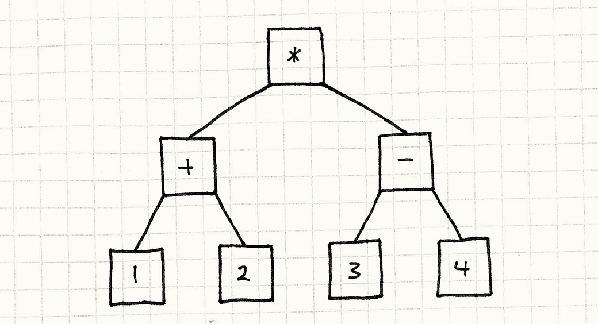

Page dedicated to knowledge related to [bytecode](https://gameprogrammingpatterns.com/bytecode.html).

## My opinion about it

The idea of bytecode is to define a higher level language to allow external people and such to edit the behavior of the code by editing the data. The bytecode pattern does not seem fitting for small teams. I believe it is too much time consuming but is a code example of a transpiler. Moreover, modern game engine/framework such as Unreal Engine and Unity have visual scripting.

## The interpreter pattern

### The pattern

The Interpreter pattern isn’t about creating that tree; it’s about executing it.

```cpp
(1 + 2) * (3 - 4)
```



```cpp
// define number expression
class NumberExpression : public Expression
{
public:
  NumberExpression(double value)
  : value_(value)
  {}

  virtual double evaluate()
  {
    return value_;
  }

private:
  // a number just hold a value
  double value_;
};
// addition expression
class AdditionExpression : public Expression
{
public:
  AdditionExpression(Expression* left, Expression* right)
  : left_(left),
    right_(right)
  {}

  virtual double evaluate()
  {
    // Evaluate the operands.
    double left = left_->evaluate();
    double right = right_->evaluate();

    // Add them.
    return left + right;
  }

private:
  // an addition has a right and left member
  Expression* left_;
  Expression* right_;
};
```

### Why it is wrong

It looks nice, but the code is represented as a sprawling fractal tree of tiny objects. Problems:
- Loading it from disk requires instantiating and wiring up tons of these small objects.
- Those objects and the pointers between them use a lot of memory. On a 32-bit machine, that little arithmetic expression up there takes up at least 68 bytes, not including padding.
- Traversing the pointers into subexpressions is murder on your data cache. Meanwhile, all of those virtual method calls wreak carnage on your instruction cache.

### Towards a solution

Consider our game. When we run it, the player’s computer doesn’t traverse a bunch of C++ grammar tree structures at runtime. Instead, we compile it ahead of time to machine code, and the CPU runs that. What’s machine code got going for it?
- dense: solid, contiguous blob of binary data, and no bit goes to waste.
- linear: Instructions are packed together and executed one right after another.
- low-level: Each instruction does one relatively minimal thing.
- fast. As a consequence of all of these.

## Bytecode pattern

The idea of bytecode pattern is having an instruction set to define low-level operation. The idea behind is creating our own language with and transpiler.

### Define instruction

```cpp
enum Instruction
{
  INST_SET_HEALTH      = 0x00,
  INST_SET_WISDOM      = 0x01,
  INST_SET_AGILITY     = 0x02,
  INST_PLAY_SOUND      = 0x03,
  INST_SPAWN_PARTICLES = 0x04
};
```

### Creating a stackmachine

```cpp
class VM
{
public:
  VM()
  : stackSize_(0)
  {}

  // Other stuff...

private:
  static const int MAX_STACK = 128;
  int stackSize_;
  int stack_[MAX_STACK];
};
```

### Creating an interpreter

```cpp
switch (instruction)
{
  case INST_SET_HEALTH:
  {
    int amount = pop();
    int wizard = pop();
    setHealth(wizard, amount);
    break;
  }

  case INST_SET_WISDOM:
  case INST_SET_AGILITY:
    // Same as above...

  case INST_PLAY_SOUND:
    playSound(pop());
    break;

  case INST_SPAWN_PARTICLES:
    spawnParticles(pop());
    break;

  case INST_ADD:
  {
    int b = pop();
    int a = pop();
    push(a + b);
    break;
  }

}
```


